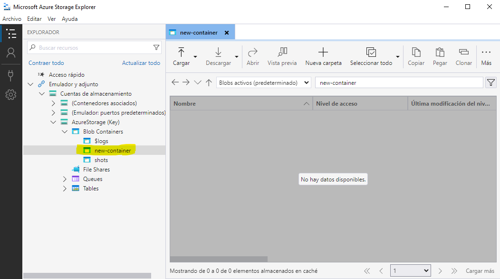

# Ejemplo: Crear un Registro de Contenedores en Azure

Este ejemplo muestra cómo crear un registro de contenedores en Microsoft Azure utilizando .NET 6 y Azure Storage. Un registro de contenedores es esencial para administrar y distribuir imágenes de contenedores en Azure.



Para validar el resultado final en Microsoft Azure Storage Explorer, sigue estos pasos:

1. Abre Microsoft Azure Storage Explorer y accede a tu cuenta de Azure.

2. Navega hasta el contenedor que creaste utilizando este ejemplo ("new-container" en este caso).

3. Verifica que el contenedor se haya creado correctamente y que esté listo para su uso.

¡Listo! Ahora puedes utilizar el contenedor en tus aplicaciones o cargar objetos en él según sea necesario.

## Requisitos

- [Visual Studio 2022](https://visualstudio.microsoft.com/) o [Visual Studio Code](https://code.visualstudio.com/) con soporte para .NET 6.
- Una cuenta de Microsoft Azure con un servicio de almacenamiento de blobs configurado.

## Configuración

Antes de ejecutar este ejemplo, asegúrate de configurar la cadena de conexión a tu servicio de almacenamiento de blobs de Azure en el archivo `appsettings.json`. La cadena de conexión se debe definir en la sección `"AzureStorage"` del archivo como se muestra a continuación:

```json
{
  "ConnectionStrings": {
    "AzureStorage": "Tu Cadena de conexión de Azure Storage"
  }
}
```

Reemplaza `"Tu Cadena de conexión de Azure Storage"` con la cadena de conexión real proporcionada por tu cuenta de Azure.

El proyecto **AzureContainerRegistryCreator** tiene las siguientes referencias de paquete:

- **[net6.0]:**
  | Paquete de nivel superior                                | Solicitado | Resuelto |
  | --------------------------------------------------------- | ---------- | --------- |
  | Microsoft.Azure.Storage.Blob                           | 11.2.3     | 11.2.3    |
  | Microsoft.Extensions.Configuration                     | 7.0.0      | 7.0.0     |
  | Microsoft.Extensions.Configuration.FileExtensions      | 7.0.0      | 7.0.0     |
  | Microsoft.Extensions.Configuration.Json                | 7.0.0      | 7.0.0     |

Puedes listar estas referencias de paquete utilizando el siguiente comando:

```shell
dotnet list AzureContainerRegistryCreator.sln package
```

## Ejecución del Ejemplo

1. Clona este repositorio a tu entorno de desarrollo local.

2. Abre el proyecto `create-azure-container-registry` en tu IDE.

3. Sigue las instrucciones en el archivo `Program.cs` para ejecutar el ejemplo. El código se encargará de crear un nuevo contenedor en tu cuenta de Azure Blob Storage.

4. Una vez ejecutado, el resultado se mostrará en la consola, indicando si el contenedor se creó correctamente o si ya existe.


## Información de interés acerca de Blob Storage
### Introducción a Azure Storage
Azure Blob Storage es la **solución de almacenamiento de objetos** de Microsoft para la nube. Blob Storage está optimizado para el almacenamiento de cantidades masivas de datos no estructurados, como texto o datos binarios.

Blob Storage resulta ideal para lo siguiente:

- Visualización de imágenes o documentos directamente en un explorador.
- Almacenamiento de archivos para acceso distribuido.
- Streaming de audio y vídeo.
- Almacenamiento de datos para copia de seguridad y restauración, recuperación ante desastres y archivado.
- Almacenamiento de datos para el análisis en local o en un servicio hospedado de Azure.

Se puede acceder a los objetos de Blob Storage desde cualquier parte del mundo a través de **HTTP o HTTPS**. Los usuarios o las aplicaciones cliente pueden acceder a los blobs mediante direcciones URL, la **API REST de Azure Storage**, **Azure PowerShell**, la **CLI de Azure** o una biblioteca cliente de Azure Storage. Las bibliotecas de cliente de almacenamiento están disponibles para varios lenguajes, como **.NET, Java, Node.js, Python, PHP y Ruby**.

Los clientes también pueden conectarse de forma segura a Blob Storage mediante el protocolo de transferencia de archivos **SSH (SFTP)** y montar contenedores de Blob Storage mediante el protocolo del sistema de archivos de red **(NFS) 3.0**.
